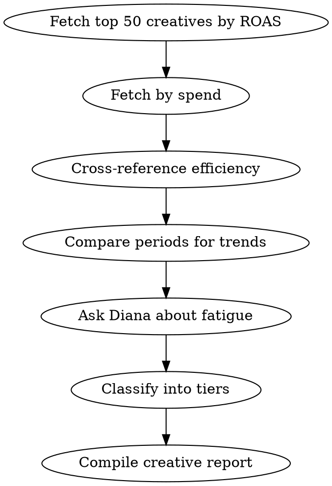

# Creative Analysis

Comprehensive creative performance analysis.

## Process

1. **Top performers**
   - Call `get_creative_report` with `sortBy: "roas"` and `limit: 50`

2. **Spend efficiency**
   - Call `get_creative_report` with `sortBy: "spend"` to find high-spend creatives
   - Cross-reference: high spend + low ROAS = waste

3. **Period comparison**
   - Call `compare_performance` to identify trends
   - Creatives with declining CTR may signal fatigue

4. **Ask Diana**
   - Call `ask_diana`: "Which creatives show signs of fatigue and which have room to scale?"

## Output Format

### Creative Performance Tiers
- **Scale** (high ROAS, room for more spend): List with metrics
- **Maintain** (solid ROAS, stable): List
- **Watch** (declining metrics): List with warning signals
- **Kill** (low ROAS, high spend): List with savings potential

### Platform Comparison
Which platform's creatives perform best and why

### Scaling Recommendations
Specific creatives to increase budget on, with suggested amounts

## Process Flow

## Red Flags
- CTR declining over 3+ weeks -> creative fatigue confirmed
- High impression count + stable CTR but declining conversions -> audience saturation
- New creative outperforming by >3x -> test at larger scale before declaring winner
- All "Kill" tier creatives from same platform -> platform issue, not creative issue

## Error Handling

- If MCP server returns connection error -> Check that `METRIKIA_API_KEY` is set and valid
- If "tenant not found" -> API key may have wrong scope. Need `mcp:read` minimum
- If rate limited (429) -> Wait 60 seconds, reduce batch sizes
- If empty results -> Verify date range and check if data sources are synced via `get_sync_status`
