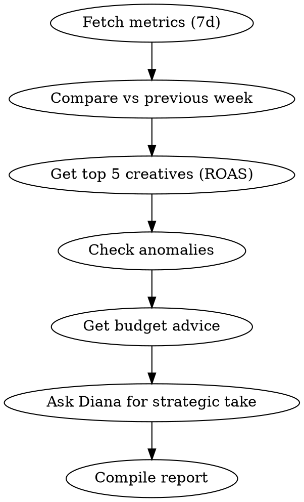

# Weekly Performance Report

Generate a complete weekly ad performance report for the current tenant.

## Process

1. **Fetch current period metrics**
   - Call `get_metrics` with last 7 days
   - Call `compare_performance` with `comparisonType: "previous_period"` for week-over-week trends

2. **Identify top and bottom performers**
   - Call `get_creative_report` with `sortBy: "roas"` and `limit: 5` for top creatives
   - Call `get_creative_report` with `sortBy: "spend"` and `limit: 10` for highest spenders

3. **Check for anomalies**
   - Call `get_anomalies` to surface any detected issues

4. **Get budget recommendations**
   - Call `get_budget_advice` with `period: "7d"`

5. **Get Diana's strategic take**
   - Call `ask_diana` with: "Based on this week's performance, what are the top 3 actions I should take next week?"

## Output Format

Present the report in this structure:

### Performance Summary
- Total Spend | Revenue | Profit
- MER | ROAS | CRM ROAS
- Week-over-week changes (with trend arrows)

### Top 5 Creatives by ROAS
Table: Name | Platform | Spend | Revenue | ROAS | CTR

### Anomalies Detected
List any anomalies with severity and recommended action

### Budget Recommendations
Summarize Diana's reallocation suggestions

### Strategic Recommendations
Diana's top 3 actions for next week

Keep the report concise and action-oriented. Use tables for data, bullet points for insights.

## Process Flow

## Red Flags
- MER dropping >20% week-over-week -> investigate immediately
- Spend anomaly with no revenue change -> possible tracking issue, check `get_sync_status`
- All creatives declining -> likely audience fatigue, not individual creative issue
- Revenue up but ROAS down -> scaling too aggressively, check CPL trends

## Error Handling

- If MCP server returns connection error -> Check that `METRIKIA_API_KEY` is set and valid
- If "tenant not found" -> API key may have wrong scope. Need `mcp:read` minimum
- If rate limited (429) -> Wait 60 seconds, reduce batch sizes
- If empty results -> Verify date range and check if data sources are synced via `get_sync_status`
