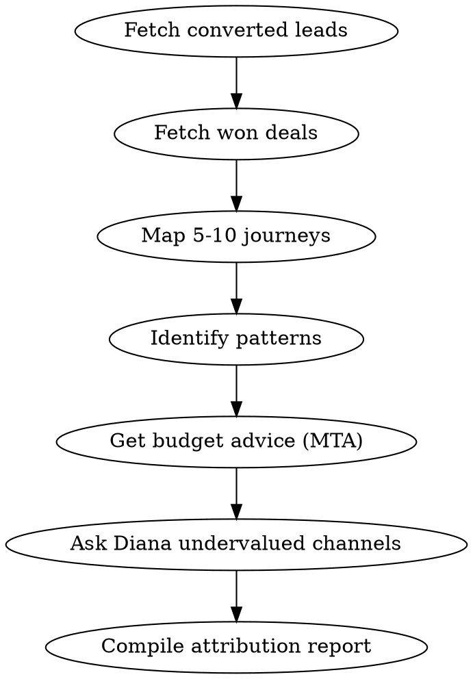

# Attribution Deep Dive

Analyze multi-touch attribution to understand the true value of each marketing channel.

## Process

1. **Get recent conversions**
   - Call `list_leads` with status "converted" to find recent conversions
   - Call `list_deals` with status "won" for revenue data

2. **Journey analysis**
   - For 5-10 converted leads, call `get_attribution_journey` to map full journeys
   - Identify common patterns: first touch channels, assist channels, closing channels

3. **Channel contribution**
   - Call `get_budget_advice` for attribution-enriched insights
   - Compare last-touch vs multi-touch attribution to find undervalued channels

4. **Ask Diana**
   - Call `ask_diana`: "Based on multi-touch attribution, which channels are undervalued by last-click and deserve more budget?"

## Output Format

### Journey Patterns
Common conversion paths (e.g., "Facebook Ad -> Google Search -> Direct -> Conversion")

### Channel Contribution
Table: Channel | First Touch % | Assist % | Last Touch % | True Value (MTA)

### Undervalued Channels
Channels that get little last-click credit but contribute heavily to assists

### Optimization Opportunities
Specific actions to improve the conversion path

## Process Flow

## Red Flags
- Channel shows 0% last-touch but >15% assist → severely undervalued, investigate
- Average journey >7 touchpoints → long consideration cycle, adjust attribution window
- Single-touch conversions dominating → either tracking gap or very direct funnel
- Large gap between platform-reported and MTA conversions → deduplication needed

## Error Handling

- If MCP server returns connection error → Check that `METRIKIA_API_KEY` is set and valid
- If "tenant not found" → API key may have wrong scope. Need `mcp:read` minimum
- If rate limited (429) → Wait 60 seconds, reduce batch sizes
- If empty results → Verify date range and check if data sources are synced via `get_sync_status`
