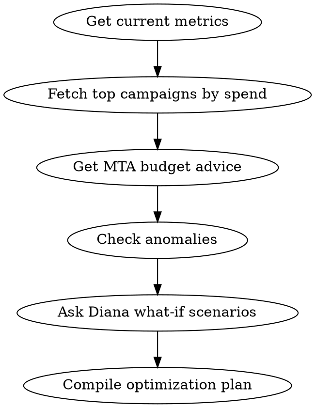

# Budget Optimizer

Optimize budget allocation across platforms and campaigns.

## Process

1. **Current allocation**
   - Call `get_metrics` for current period
   - Call `get_campaign_performance` for top 10 campaigns by spend

2. **Attribution-based analysis**
   - Call `get_budget_advice` for MTA-enriched recommendations
   - This uses multi-touch attribution to identify where budget actually drives conversions

3. **What-if scenarios**
   - Call `ask_diana`: "If I shift 20% of budget from [lowest ROAS platform] to [highest ROAS platform], what's the expected impact?"

4. **Anomaly check**
   - Call `get_anomalies` to identify any spend anomalies before reallocating

## Output Format

### Current Budget Allocation
Platform breakdown: Spend | Revenue | ROAS | % of Budget

### MTA-Based Recommendations
Diana's reallocation suggestions with expected impact

### Risk Assessment
Anomalies or concerns to address before changes

### Action Plan
Step-by-step reallocation instructions with specific amounts

## Process Flow

## Red Flags
- Reallocating >30% of budget at once → too risky, do 10-15% increments
- Budget advice conflicts with anomaly data → resolve anomalies first
- Platform with no attribution data → don't cut budget, fix tracking first
- Highest ROAS campaign at max spend → look for diminishing returns signal

## Error Handling

- If MCP server returns connection error → Check that `METRIKIA_API_KEY` is set and valid
- If "tenant not found" → API key may have wrong scope. Need `mcp:read` minimum
- If rate limited (429) → Wait 60 seconds, reduce batch sizes
- If empty results → Verify date range and check if data sources are synced via `get_sync_status`
