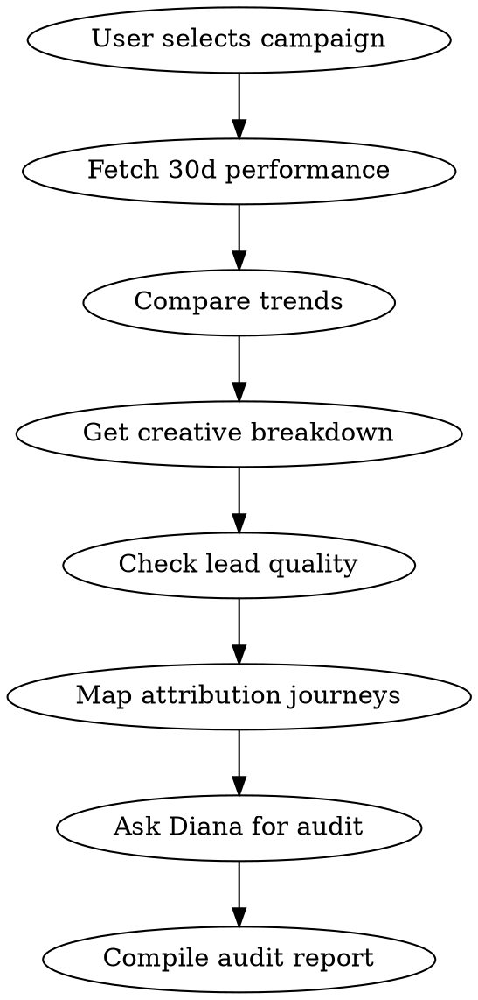

# Campaign Audit

Perform a deep audit of a specific campaign.

## Prerequisites
Ask the user which campaign to audit. Use `list_campaigns` to show available campaigns if needed.

## Process

1. **Campaign performance**
   - Call `get_campaign_performance` with the campaignId and last 30 days
   - Call `compare_performance` for the same campaign to see trends

2. **Creative breakdown**
   - Call `get_creative_report` filtered by campaign
   - Identify top and underperforming creatives

3. **Lead quality**
   - Call `list_leads` to find leads attributed to this campaign
   - For key leads, call `get_attribution_journey` to see the full path

4. **Ask Diana**
   - Call `ask_diana`: "Audit campaign [name]: what's working, what's not, and what should I change?"

## Output Format

### Campaign Overview
Key metrics: Spend, Revenue, ROAS, CRM ROAS, CPL, CPC, CTR

### Creative Performance Matrix
Table of all creatives ranked by efficiency

### Attribution Insights
How leads from this campaign convert — journey patterns, time to conversion

### Optimization Recommendations
Actionable next steps: scale, pause, or iterate

Be specific with numbers. Don't just say "good" — say "3.2x ROAS vs 2.1x benchmark."

## Process Flow

## Red Flags
- High CTR + low conversion → landing page issue, not ad issue
- High spend creative with no leads → check tracking pixel, not the creative
- ROAS good but CRM ROAS bad → lead quality problem, tighten targeting
- Single creative >60% of campaign spend → concentration risk

## Error Handling

- If MCP server returns connection error → Check that `METRIKIA_API_KEY` is set and valid
- If "tenant not found" → API key may have wrong scope. Need `mcp:read` minimum
- If rate limited (429) → Wait 60 seconds, reduce batch sizes
- If empty results → Verify date range and check if data sources are synced via `get_sync_status`
