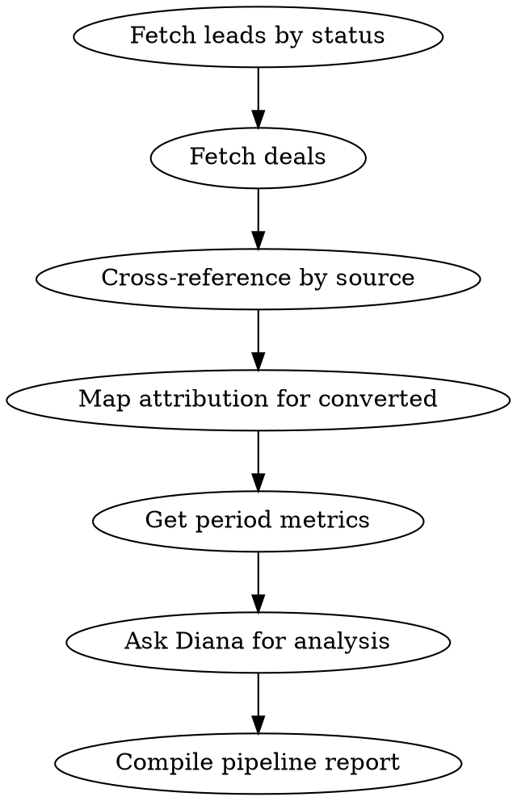

# Lead Pipeline Analysis

Analyze the current CRM pipeline health.

## Process

1. **Pipeline overview**
   - Call `list_leads` with status filters: qualified, contacted, converted
   - Call `list_deals` to see open deals and won deals

2. **Source analysis**
   - Cross-reference leads by source to identify highest-quality acquisition channels

3. **Attribution deep-dive**
   - For recently converted leads, call `get_attribution_journey` to understand which campaigns drove conversions

4. **Metrics context**
   - Call `get_metrics` for the period to correlate ad spend with lead generation

5. **Diana insights**
   - Call `ask_diana`: "Analyze my lead pipeline: which sources have the best conversion rates and what's the bottleneck?"

## Output Format

### Pipeline Health
- Total leads by status (funnel visualization)
- Conversion rate: Lead -> Qualified -> Converted
- Average deal value

### Source Performance
Table: Source | Leads | Qualified | Converted | Conversion Rate | Avg Deal Value

### Top Conversion Journeys
Show 3-5 example attribution journeys for converted leads

### Recommendations
Where to invest more, where to cut, bottleneck fixes

## Process Flow

## Red Flags
- High lead volume + low qualification rate → targeting too broad
- Qualified leads not converting to deals → sales process issue, not marketing
- One source dominating pipeline → diversification risk
- Long time in "contacted" status → sales capacity bottleneck

## Error Handling

- If MCP server returns connection error → Check that `METRIKIA_API_KEY` is set and valid
- If "tenant not found" → API key may have wrong scope. Need `mcp:read` minimum
- If rate limited (429) → Wait 60 seconds, reduce batch sizes
- If empty results → Verify date range and check if data sources are synced via `get_sync_status`
